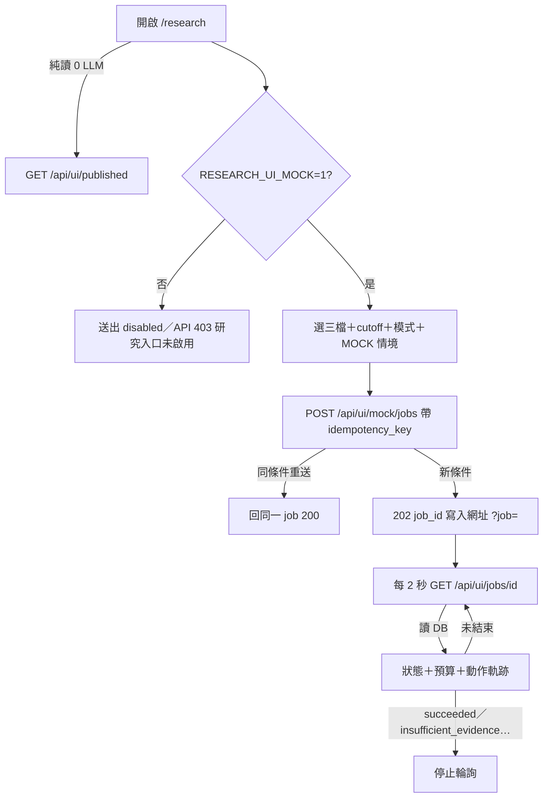

# W02-A｜研究工作台流程與狀態

- 任務 ID：W02-A（原排程 09-21～09-25，2026-10-05 補做）｜驗收人：組長
- 分支：`codex/W02-A-research-workspace`（基於 W01-A）
- 前置：W01-A ✓；W02-L（組長 job 契約與 API）✓ 已在 main

## 1. 決策紀錄（2026-10-05，A 與 AI 協作確認）

| 項目 | 決定 | 原因 |
|---|---|---|
| 授權方式 | **先全用 MOCK**。頁面不持有 `RESEARCH_API_TOKEN`，也不呼叫組長的 `/api/research/jobs` | 正式授權（登入 or 其他）由組長決定；避免 token 進瀏覽器 |
| MOCK 開關 | 環境變數 `RESEARCH_UI_MOCK=1` 才開；Render 未設定 → 送出按鈕 disabled、API 回 403 | 公開網站不能建立任何 job |
| job 狀態來源 | 組長的 `agents.store.JobStore`（獨立 SQLite：`RESEARCH_UI_MOCK_DB`，預設 `tmp/research_ui_mock.sqlite3`） | 狀態一律從 DB 讀，重整/重啟不丟 |
| 驗證規則 | 直接重用 `agents.contract.validate_job_request` | 2379/3034 拒絕、cutoff 必填、冪等鍵規則與正式 API 一致 |

## 2. 流程



## 3. 防重複與防誤觸

- 按鈕送出期間 disabled；冪等鍵 = `ui-{ticker}-{cutoff}-{mode}-{scenario}-{分頁 nonce}`，同一分頁重複點擊或重整後重送都回同一個 job。
- 收藏（☆）與「送出研究」是不同按鈕；收藏、篩選、排序、開舊報告都**不會**建立 job。
- 比較標的 2379、3034 只出現在收藏選單，研究標的只有 2330/2317/2454 三顆。

## 4. 收藏與已發布清單（F03 骨架）

- `localStorage` 鍵 `fintech-agent.favorites.v1`：只存股票代號陣列，最多 5 檔，白名單 2330/2317/2454/2379/3034。讀寫都包 try/catch（無痕模式也能顯示）。
- 不跨裝置；清除瀏覽器資料會清空（頁面文字已說明）。
- 清單來源 `GET /api/ui/published`：伺服器只回 `publication_status == "published"` 的列；W02 資料來自 `ui/v12-dashboard-fixture.json`（**FIXTURE**），W07 後改讀組長的 report_versions。
- 欄位：代號、公司、report_version_id、資料截止、財報期、發布時間、來源更新、估值狀態、資料品質風險、PDF 狀態；時間一律 Asia/Taipei。

## 5. 已處理狀態

| 狀態 | 畫面 |
|---|---|
| 載入中 | 「讀取 job 狀態中…」「載入已發布研究中…」 |
| 空白 | 尚未選 job／沒有已發布研究／收藏中沒有研究 |
| 未授權 | 403 → 「研究入口未啟用」 |
| 排隊 | 「一次只執行 1 個 job，前面還有 N 個」 |
| 錯誤 | 404 找不到 job、非 JSON 回應、清單讀取失敗 |
| 資料不足 | insufficient_evidence 徽章＋說明不產生評級 |

## 6. 測試（實際執行）

```
.venv/bin/python -m pytest -q tests     # 2026-10-05：95 passed（含 tests/test_research_ui.py）
```

`tests/test_research_ui.py` 涵蓋：頁面不含 token/Supabase key/同步分析端點；`web_app` 已註冊路由；草稿不出現在公開清單；讀頁不觸發 `stock_payload`；收藏只存代號且上限 5；MOCK 關閉時 403；重複點擊同一 job；2379/3034 被拒；壞請求 400/409；重啟後同一 job 可讀；狀態依時間從 DB 前進且 pending 不冒充完成；事件只輸出白名單欄位。

## 7. 截圖（headless Chromium，本機 MOCK，2026-10-05）

| 檔案 | 尺寸 | 橫向溢出 |
|---|---|---|
| `design/w02/W02-workspace-empty-1440x900.png` | 1440×900 | 0 px |
| `design/w02/W02-workspace-empty-390x844.png` | 390 寬全頁 | 0 px |
| `design/w02/W02-job-running-1440x900.png` | 1440×900 | 0 px |
| `design/w02/W02-favorites-filter-390x844.png` | 390 寬全頁 | 0 px |

## 8. 驗收自查

| 驗收項 | 結果 |
|---|---|
| 不把 API key 傳前端 | ✓ 測試斷言頁面與 JS 不含 token/key，也沒有 Authorization 標頭 |
| 重複點擊不產生多 job | ✓ `test_repeated_click_returns_same_job` |
| 390px 無橫向破版 | ✓ 實測溢出 0 px |
| 重整收藏仍在 | ✓ localStorage；截圖以預載收藏驗證 |
| 無 key 或敏感財務 | ✓ 只存代號 |
| 比較標的不開研究 job | ✓ `test_comparison_tickers_never_create_jobs` |

## 9. 未完成／需要誰

- 正式授權方式（登入、角色）→ **組長**決定後，把 `/api/ui/mock/jobs` 換成伺服器代為呼叫正式 API。
- 已發布清單真實資料 → **組長** W07 report_versions。
- 估值狀態與資料品質風險規則 → W05-A，需 **B、D** 核對文字。
